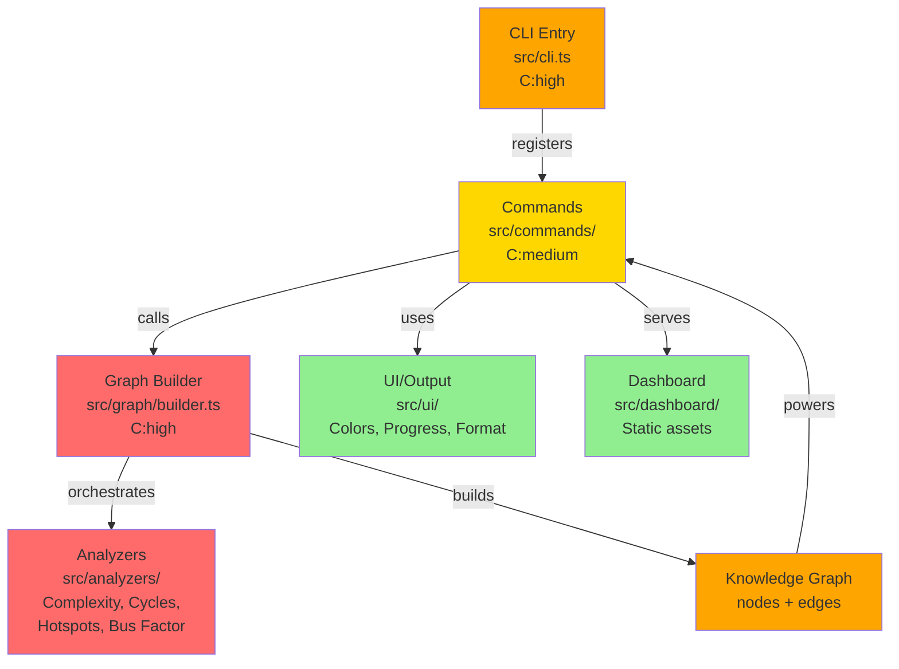
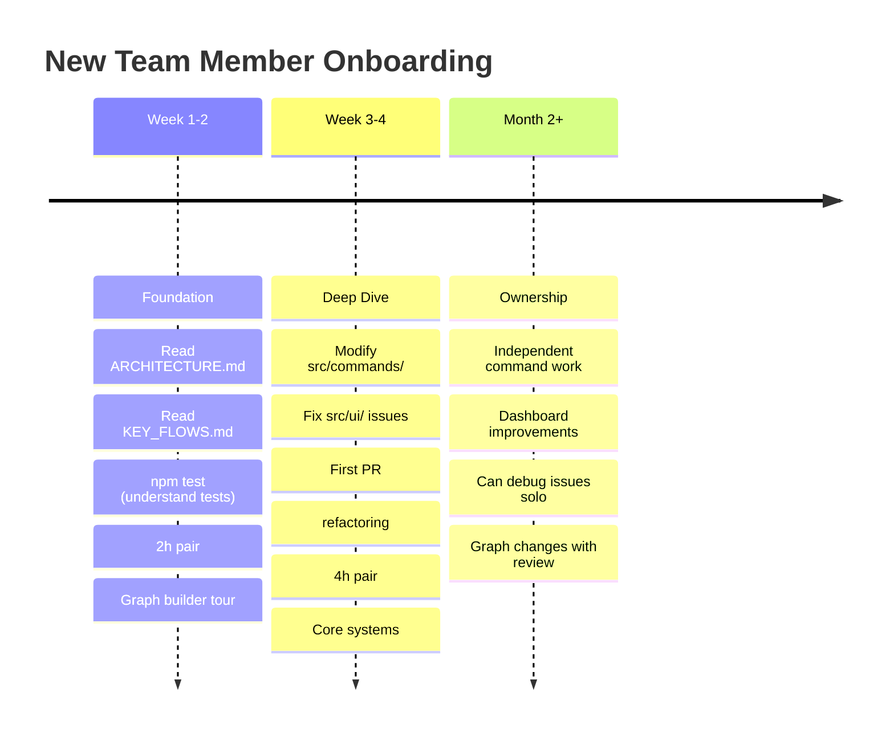

# Team Ownership & Knowledge Base

> **Current Status:** 🔴 CRITICAL - All code owned by Elizabeth Stein (100% bus factor)  
> **Risk Level:** DANGEROUS - Single point of failure  
> **Recommended Action:** Pair programming + cross-training on all changes

---

## Visual Guides

### Code Architecture Dependencies



### Onboarding Timeline



### Pairing Decision Tree

```mermaid
graph TD
    A{What are you<br/>modifying?}
    
    A -->|src/graph/| B["🔴 PAIR REQUIRED<br/>Core logic - Elizabeth<br/>must approve"]
    A -->|src/analyzers/| C["🔴 PAIR REQUIRED<br/>Analysis algorithms<br/>impact all metrics"]
    A -->|src/cli.ts| D["🔴 PAIR REQUIRED<br/>Infrastructure change<br/>affects all commands"]
    A -->|src/commands/| E{Complexity?}
    A -->|src/ui/| F["🟢 SOLO OK<br/>UI/display logic<br/>isolated concerns"]
    A -->|tests/| G["🟢 SOLO OK<br/>Test coverage<br/>no runtime impact"]
    A -->|docs/| H["🟢 SOLO OK<br/>Documentation<br/>knowledge sharing"]
    
    E -->|< 20| I["🟢 SOLO OK<br/>Simple feature<br/>low risk"]
    E -->|">= 20| J["🟡 PAIR RECOMMENDED<br/>Complex logic<br/>affects multiple areas"]
    
    style B fill:#ff6b6b
    style C fill:#ff6b6b
    style D fill:#ff6b6b
    style J fill:#ffa500
    style I fill:#90EE90
    style F fill:#90EE90
    style G fill:#90EE90
    style H fill:#90EE90
```

### Critical vs Safe Zones

```mermaid
quadrantChart
    title Code Modification Risk Matrix
    x-axis Low Complexity --> High Complexity
    y-axis Low Impact --> High Impact
    
    Safe to Modify: 25, 25
    Refactor Only: 75, 25
    Pair Required: 20, 90
    Expert Review: 75, 90
```

---

## Code Ownership Map

### Critical Areas (Immediate Pairing Required)

| Area | Owner | Risk | Key Files | Est. Knowledge Time |
|------|-------|------|-----------|-------------------|
| **Core Analysis Engine** | Elizabeth Stein | CRITICAL | `src/graph/`, `src/analyzers/` | 40h |
| **CLI Infrastructure** | Elizabeth Stein | CRITICAL | `src/cli.ts`, `src/commands/` | 30h |
| **Knowledge Graph** | Elizabeth Stein | CRITICAL | `src/graph/builder.ts`, `src/graph/types.ts` | 35h |
| **Dashboard/UI** | Elizabeth Stein | CRITICAL | `src/dashboard/`, `src/ui/` | 25h |
| **Entry Point** | Elizabeth Stein | CRITICAL | `src/index.ts`, `src/config/` | 20h |

---

## How to Onboard New Team Members

### Phase 1: Foundation (Week 1-2)
**Goal:** Understand architecture and data flow

1. **Read First:**
   - [docs/ARCHITECTURE.md](docs/ARCHITECTURE.md) - System design (15 min)
   - [docs/KEY_FLOWS.md](docs/KEY_FLOWS.md) - Critical workflows (20 min)
   - [README.md](README.md) - Project overview (10 min)

2. **Run These Commands:**
   ```bash
   # See overall health
   npm run build && npm test
   
   # Understand codebase structure
   npm run specter health
   npm run specter hotspots --limit 5
   npm run specter ask "What's the main analysi..." 
   ```

3. **Pair Session (2h):**
   - Elizabeth walks through graph builder flow
   - Trace a command from CLI entry to output
   - Review top 3 hotspots

### Phase 2: Deep Dive (Week 3-4)
**Goal:** Contribute to non-critical code

1. **Focus Areas:**
   - Start with `src/commands/` (simpler, isolated)
   - Then `src/ui/` (display logic, clear concerns)
   - Never start with `src/graph/` or core analyzers

2. **Pair Sessions (4h total):**
   - Graph builder internals
   - Command registration patterns
   - Adding new metrics/analyses

3. **First PR:**
   - Fix a complexity hotspot (refactor existing, don't add features)
   - Create a new personality mode
   - Add a simple analysis command

### Phase 3: Ownership (Month 2+)
**Goal:** Independently maintain assigned areas

- Take ownership of:
  - New command implementations
  - Dashboard bug fixes
  - Documentation updates
- Consult on: Core graph changes, major refactoring

---

## Decision Making Framework

### When to Pair (Required)
- ✅ Any change to `src/graph/`
- ✅ New analyzer implementation
- ✅ CLI infrastructure changes
- ✅ Major refactoring (complexity > 30)
- ✅ Performance optimization

### When to Solo (After Onboarding)
- ✅ New command features
- ✅ UI/dashboard improvements
- ✅ Bug fixes in isolated files
- ✅ Documentation updates
- ✅ Tests for new features

---

## Critical Code Patterns

### The Knowledge Graph
**File:** `src/graph/builder.ts`  
**Why Complex:** Orchestrates 5 parallel analyses, merges results  

**Key Insight:** Order matters - cycles before complexity, complexity before hotspots.

```typescript
// Analysis order (see buildGraph):
1. Complexity analysis     // provides baseline C scores
2. Cycles detection        // identifies feedback loops  
3. Hotspot calculation     // uses complexity + churn
4. Bus factor analysis     // git history + code ownership
5. Dead code detection     // unused exports
```

**When Modifying:**
- Don't reorder analyses without testing
- Always run full test suite (313 tests)
- Check velocity/drift metrics post-change

### The Command System
**File:** `src/commands/` + `src/cli.ts`  
**Pattern:** Register → Parse Options → Execute → Format Output

**Example:** Adding a new command
```typescript
// 1. Create src/commands/analysis/new-metric.ts
export async function register(program: Command) {
  program
    .command('my-metric')
    .description('...')
    .action(async (options) => {
      const graph = await buildGraph(rootDir);
      const result = await analyzeMyMetric(graph);
      console.log(formatResult(result));
    });
}

// 2. Wire into src/commands/index.ts
```

---

## File Complexity Guide

### "Safe to Modify" (You Can Handle)
- **Complexity < 15:** Standalone function, clear purpose
  - `src/ui/colors.ts` (C:8) ✅
  - `src/ui/progress.ts` (C:12) ✅

### "Requires Pairing" (Knowledge Needed)
- **Complexity 15-30:** Multiple concerns, integration points
  - `src/morning.ts` (C:30) - Multiple analyses + formatting

### "Needs Expert Review" (Elizabeth Sign-Off)
- **Complexity > 30:** Core logic, multiple files depend on it
  - `src/ask.ts` (C:39) - Graph search + personality system
  - `src/graph/builder.ts` - All analyses merge here

---

## Communication Channels

### For Questions:
- **Quick questions:** Sync chat or standup
- **Complex issues:** Pair session before diving in
- **PRs:** Always tag Elizabeth for review on graph/core changes

### Documentation:
- **New patterns discovered:** Add to [docs/KEY_FLOWS.md](docs/KEY_FLOWS.md)
- **Command patterns:** Update [docs/ARCHITECTURE.md](docs/ARCHITECTURE.md)
- **Gotchas learned:** Add to this file

---

## Knowledge Transfer Checklist

- [ ] New team member has read ARCHITECTURE.md
- [ ] New team member has read KEY_FLOWS.md
- [ ] 2h pair session completed (graph builder tour)
- [ ] First PR submitted (refactoring or new feature)
- [ ] First graph change approved
- [ ] Demonstrated independent command implementation
- [ ] Can debug a hotspot from complaint → metric → fix
- [ ] Added one pattern/gotcha to docs

---

## Success Metrics

**Bus Factor Goal:** 2.0+ (minimum 2 people per critical area)

| Metric | Current | Target | Timeline |
|--------|---------|--------|----------|
| **Bus Factor Overall** | 1.0 | 2.0 | 6 weeks |
| **Core Graph Knowledge** | 1 person | 2 people | 8 weeks |
| **Command System Knowledge** | 1 person | 2+ people | 4 weeks |
| **UI/Dashboard Knowledge** | 1 person | 2 people | 6 weeks |

---

## How to Read the Diagrams

### 🔴 Red Zones (Critical)
- Graph Builder, Analyzers, CLI infrastructure
- **Rule:** Always pair before making changes
- **Why:** Bugs here affect all commands and metrics

### 🟠 Orange Zones (Important)
- Knowledge Graph construction, Output formatting
- **Rule:** Pair for non-trivial changes
- **Why:** Many systems depend on consistency

### 🟢 Green Zones (Safe)
- UI/display, documentation, tests, new commands
- **Rule:** Solo work OK after onboarding
- **Why:** Isolated scope, won't affect core logic

---

## References

- **Graph System:** See `src/graph/types.ts` for GraphNode/KnowledgeGraph types
- **All Commands:** `src/commands/` directory - each subdir is a category
- **Metrics:** `src/analyzers/` - each analyzer is independent
- **Tests:** `tests/` - mirror of `src/` structure, great learning resource

---

**Last Updated:** Feb 13, 2026  
**Maintained By:** Elizabeth Stein  
**Next Review:** Mar 13, 2026
